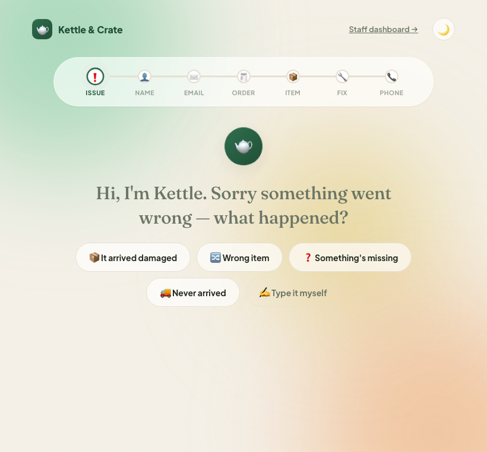
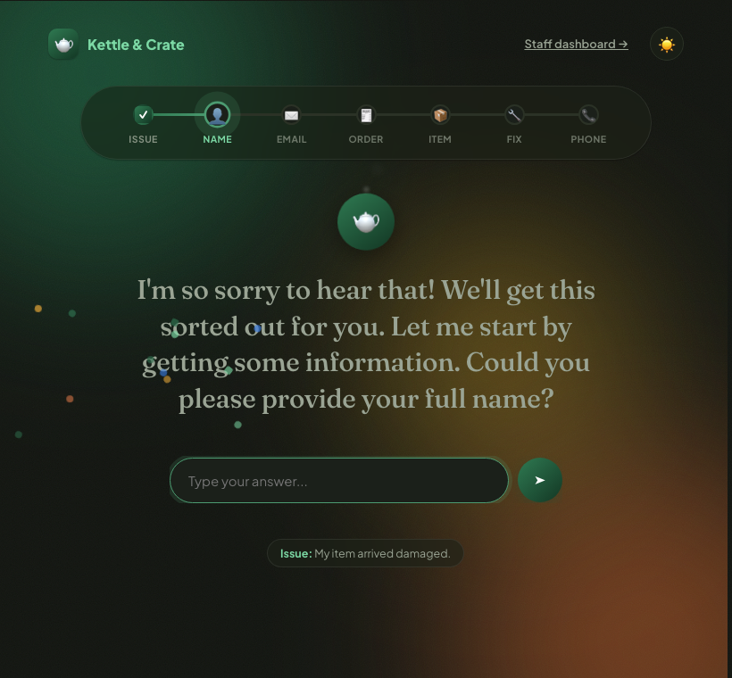
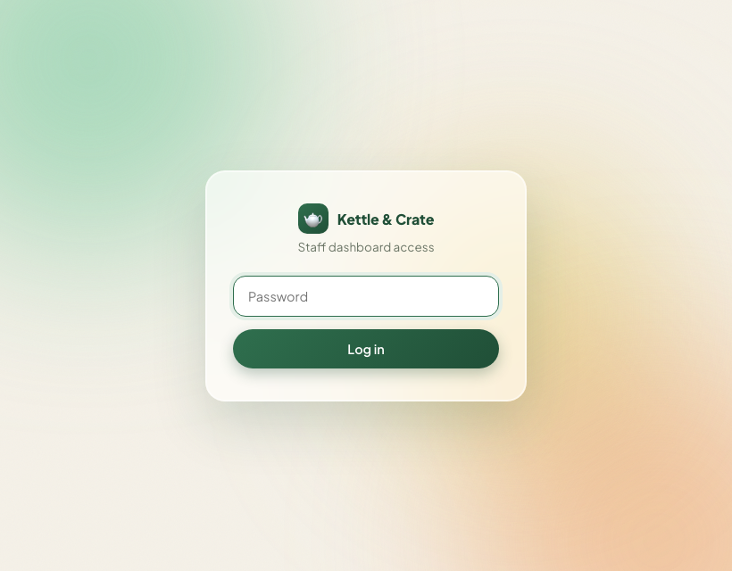
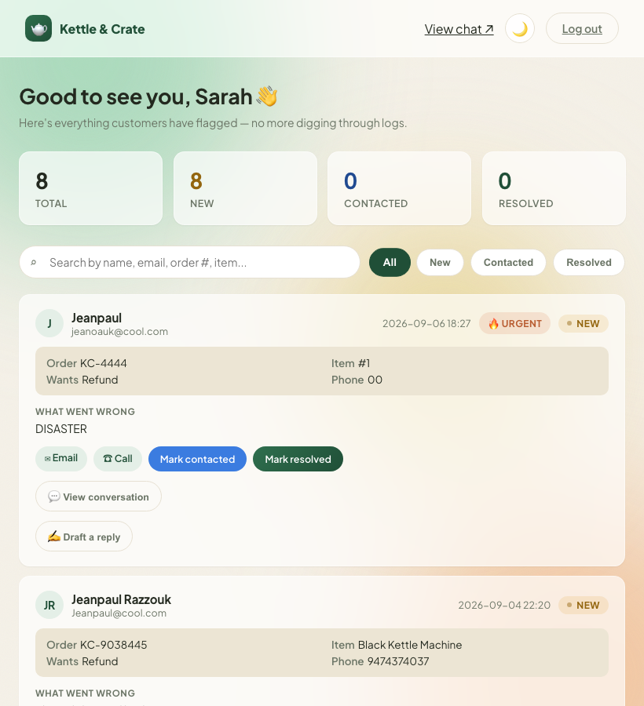
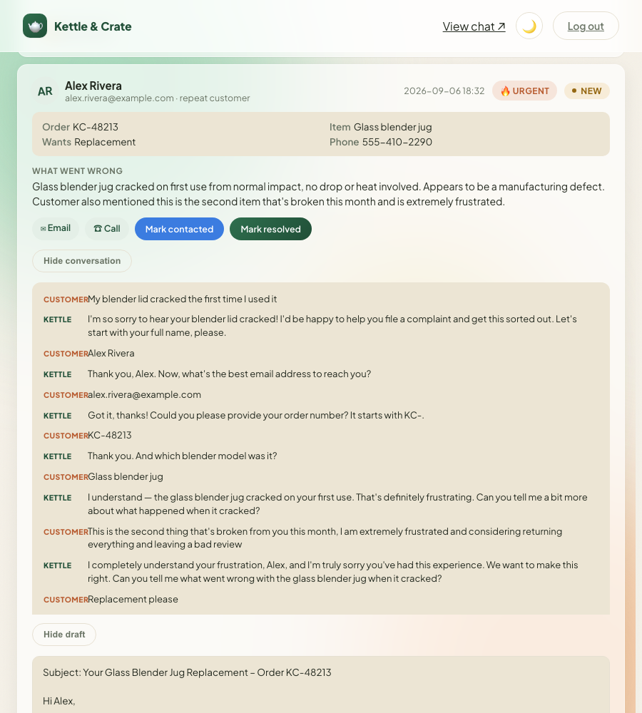
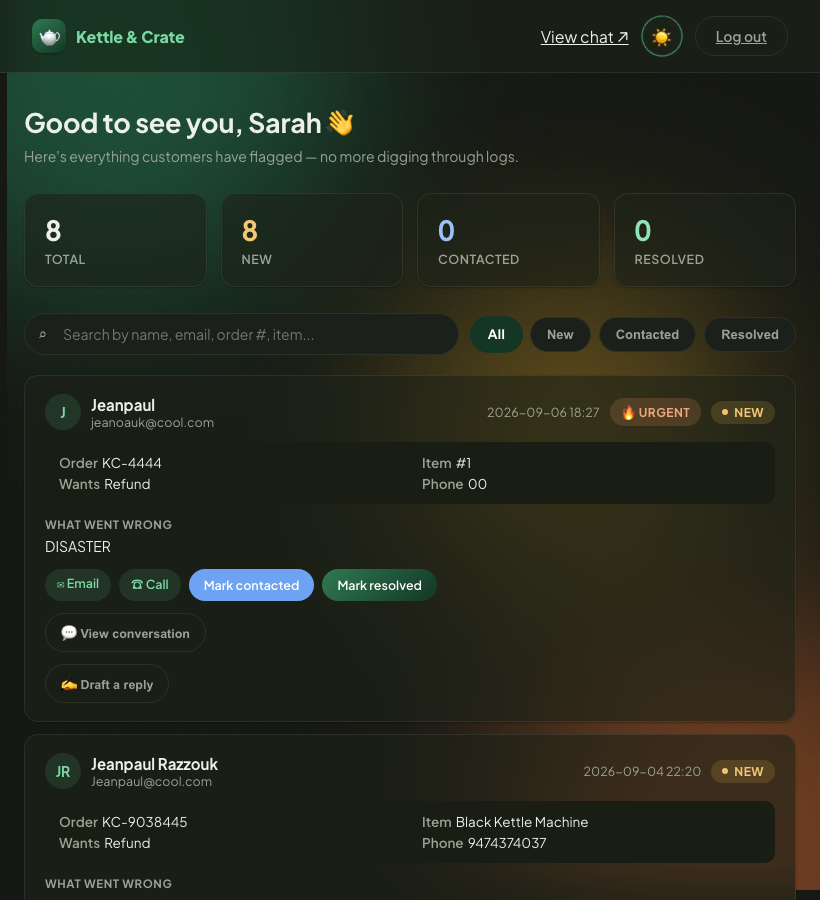
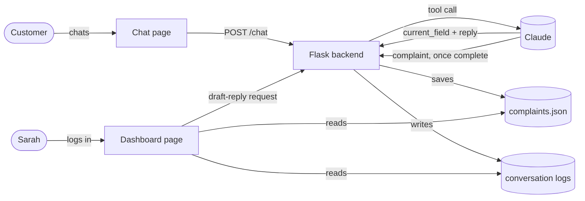
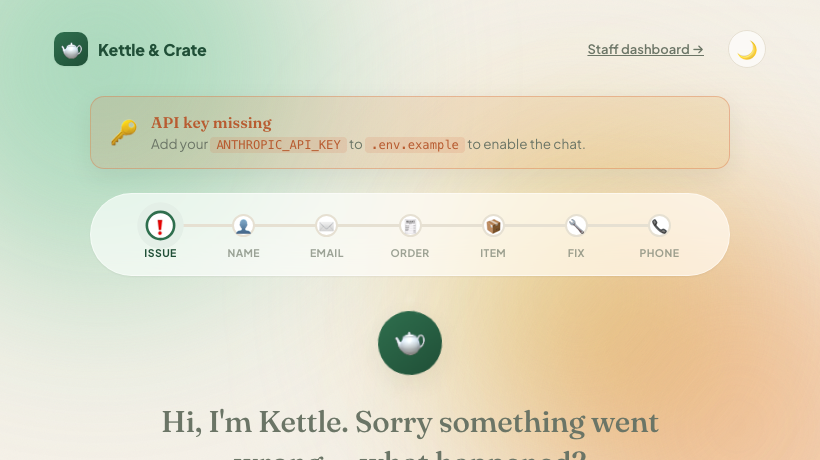

# Kettle & Crate Support Bot 🫖

An AI support assistant for kettleandcrate.com. It talks a customer through filing a complaint, then hands it off to a dashboard where Sarah, on the support team, follows up. This doc walks through the whole thing, in plain language, from the original weekend build to where it stands now, with real screenshots of the actual app, not mockups.

## What I changed, and why

This started as a weekend project: one chat page, one AI conversation, and a flat `complaints.json` file that had to be opened by hand every morning to see what came in. Below is everything that changed since, grouped by what it looks like, what makes the AI itself smarter now, and the plumbing underneath.

### The chat

The chat page had no branding and looked like a generic chat widget. I redesigned it around Kettle & Crate's own look, then rebuilt how it actually works: instead of a scrolling thread of message bubbles, the customer sees **one question at a time**, with a progress bar so they always know how much is left, and tap-to-answer buttons wherever the choices are obvious, instead of making people type everything.



*No chat bubbles: one question, a progress bar, tap-to-answer buttons.*



*Dark mode, mid-conversation. Confetti fires on every completed step, not just the end.*

### The dashboard

Didn't exist before at all. Sarah used to open `complaints.json` by hand. It's password-protected, since it holds real customer data:



Once in, every complaint is a card with live status counts, search, and one-click updates.



*Every complaint as a card, newest first, with live status counts up top.*

Each card can also open the full conversation behind it, flags itself **urgent** when the AI senses real frustration, notes **repeat** customers, and can write Sarah a **draft reply**:



*One real card, expanded: urgent flag, repeat-customer note, full conversation, and a drafted reply ready for Sarah to edit, not a blank page.*



*Same dashboard, dark mode.*

### The agent itself: what makes it more than a chatbot now

This is the part worth explaining carefully, because it's the biggest real change and the one most worth being honest about.

The original bot worked like this: it followed a script of questions, and once it had everything, it was told to end its reply with a made-up marker, literally the text `COMPLAINT_JSON: {...}`, and the backend code would search the AI's reply for that marker and try to read the data back out of it. That's a bit like asking someone to write you a letter and hoping they remember to sign it in exactly the right format so you can find the signature later. It mostly worked, but it broke in exactly the ways you'd expect: if the AI phrased something slightly differently, the marker got missed, or the wrong part of its reply got mistaken for the actual question being asked.

I rebuilt that using something called **tool calling**: a way of giving an AI model an actual form to fill out, with defined fields, instead of asking it to write free-form prose and hoping to extract meaning from it afterward. Now, every single turn, the AI:
- reports **exactly which of the 7 fields** it's currently asking about (no more guessing from wording),
- and once everything's gathered, hands back a **validated, structured complaint** (name, email, order number, item, issue, resolution, phone) plus its own judgment of how urgent the situation sounds.

That's the difference between a script that talks and something closer to a real agent: it's not just generating text anymore, it's reporting its own state and taking a defined action (filing a complaint) with data the rest of the app can actually trust, instead of the app having to guess what the AI meant.

I also tightened what it's allowed to act on. It used to be told to "fully comply with the customer's requests," which sounds friendly but is a real risk: a message disguised as a complaint could talk the AI into doing something else entirely (one of the sample complaints already reads like an attempt to sneak in a shipping address change). It now explicitly won't act on anything outside the 7 complaint fields, and politely declines and redirects if a message tries.

### The technology, plainly

Nothing exotic here on purpose. It's a small, easy-to-run app, not a big platform:



- **Python + Flask** run the whole backend: a lightweight way to serve web pages and handle requests without a lot of ceremony.
- **Claude** (Anthropic's AI model) does the actual thinking in the conversation. The app can also be switched to OpenAI's models via one setting in `.env.example` (the file it actually reads, see below).
- **Plain HTML, CSS, and JavaScript** run the pages in the browser. No framework like React needed for something this size.
- **A JSON file** (`complaints.json`) is the "database": every complaint is one entry in a list. Simple, human-readable, easy to back up, and genuinely fine at this scale.
- **Log files** (one per conversation) are how Sarah's "view conversation" feature and the automated tests both get their data: a plain text trail of who said what.

### Reliability and security

A few backend improvements that don't show up as a visible feature, but matter:

- **Rate limiting.** `/chat` now limits how many messages one visitor can send per minute, so it can't be spammed into running up a real API bill.
- **Session cleanup.** Old conversations now expire from memory after a few hours instead of piling up forever.
- **A validation gap, closed properly.** Since the very first version of this bot, the id tied to a customer's conversation has been used to build a filename for that session's log, with nothing checking what that id was actually allowed to contain. It had been sitting there quietly since day one; building out the dashboard's conversation viewer is what put a spotlight on it. It's now validated everywhere that id touches a filename, not just in the one place that surfaced it.

## How to run it

- Install the dependencies: `pip install -r requirements.txt`
- Create your private settings file: `cp .env .env.example`
- Add your key to `.env.example`: set `ANTHROPIC_API_KEY` (or `OPENAI_API_KEY` when using OpenAI).
- Start the app: `python app.py`
- Open the chat: `http://localhost:9000`
- Open the dashboard: `http://localhost:9000/dashboard` (password: `kettle-c5d454e1`)

`.env` is the safe template committed to Git. `.env.example` is the private file the app reads, so it is ignored by Git and never pushed.

To switch models, change `MODEL` in `.env.example` (the file that's actually read) and set `PROVIDER` to `anthropic` or `openai`. If the bot ever stops responding, restarting it fixes it.

If that key is ever missing or wrong, the chat page shows this instead of silently failing:



*A real, working example, not a mockup: this is what you'd see right now if `.env.example` had no key set.*

### Running the tests

```
pip install -r requirements-dev.txt
pytest tests/
```

```
============================= test session starts ==============================
collected 26 items

tests/test_app.py ............                                           [ 46%]
tests/test_bot.py ....                                                   [ 61%]
tests/test_store.py ..........                                           [100%]

============================== 26 passed in 0.11s ===============================
```

All 26 run completely offline: the AI itself is mocked out, so there's no API key, no network call, and no cost to run them. They cover the backend logic: saving and loading complaints, login, status updates, the session-id validation, and the AI-agent logic, including an edge case where a finished conversation could otherwise get filed more than once.

## What I chose not to do

- **Kept the JSON file instead of a database.** A flat file is simple, easy to read, and works fine at this scale, so it's not worth the extra complexity yet.
- **Kept frontend testing manual instead of automated.** The backend has a real, automated test suite (above). The frontend, including every screenshot in this doc, was checked by hand and with scripted browser runs throughout the build.
- **Left urgency and field-tracking as judgment calls, not guarantees.** "Urgency" is the AI's own read of how upset a customer sounds; "field-tracking" is which of the 7 questions it's currently on. Both now come directly from the AI instead of a keyword guess, which is a real improvement, but both are still the AI's interpretation of natural language, not a fixed rule. It won't be right every single time, and nothing here claims it will be.

## How I used AI along the way

This project was built with the help of Claude Code, Anthropic's agentic coding tool, across every redesign, the dashboard, the agent rebuild, the security work, and all the debugging along the way.

My side of that was the architecture, the product logic, and the UI/UX: deciding how the pieces should fit together, what the experience should actually feel like, and where the AI's own judgment could be trusted versus where it needed a stricter rule. Reviewing every pass happened by actually using the thing. Later on, the sharper check was hitting the running app directly with real requests and reading the raw responses back, and that's exactly the kind of check that catches a real edge case before it ever reaches a customer, not just a typo.
